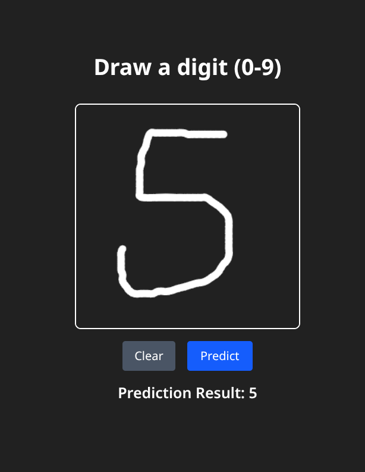

# 🧮 Handwritten Digit Recognition (KNN + Django + React)

A simple project to recognize handwritten digits drawn on a web canvas.
Built with **KNN classifier (scikit-learn)**, **Django REST Framework** for backend, and **React + Tailwind + SignatureCanvas** for frontend.

---

## 🛠️ Tech Stack
### Backend
- Python
- Django + Django REST Framework
- scikit-learn
- OpenCV
- NumPy
- Pickle (model persistence)

### Frontend
- React + Vite
- Tailwind CSS
- react-signature-canvas

---

## 🚀 How It Works
1. **Training**  
   - Run Jupyter Notebook to train the KNN classifier on MNIST.  
   - Evaluate model accuracy with test data.  
   - Save trained model using `pickle`.

2. **Backend (Django)**  
   - Load trained KNN model.  
   - Accept Base64-encoded canvas images at `/predict-digit/`.
   - Preprocess images (grayscale, resize, scale) using `cv2`.  
   - Predict digit using KNN and return JSON response.

3. **Frontend (React)**  
   - User draws digit on canvas.  
   - Convert drawing to Base64 DataURL.  
   - Send to backend API.  
   - Display predicted digit to user.

---

## ⚙️ Setup Instructions

### Backend (Django)
```bash
# clone repo
git clone https://github.com/yourusername/digit-recognition.git
cd digit-recognition/server

# setup virtual environment
pip install pipenv
pipenv shell

# install dependencies
pipenv install

# dump knn model from jupyter notebook
# copy knn.pkl into digit-recognition/server/digitrecognition

# run server
python manage.py runserver
```

### Frontend (React+Vite)
```bash
cd digit-recognition/client

# install dependencies
npm install

# run dev server
npm run dev
```

### 📸 Screenshots
